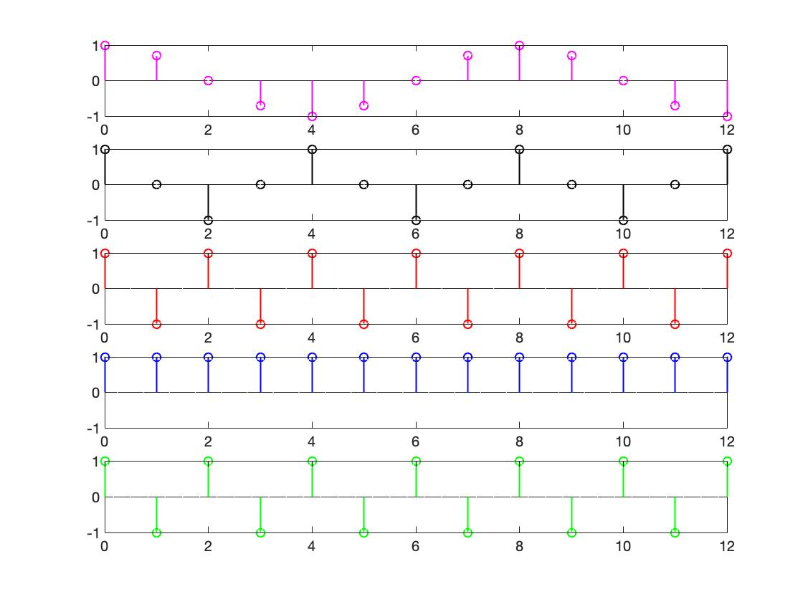
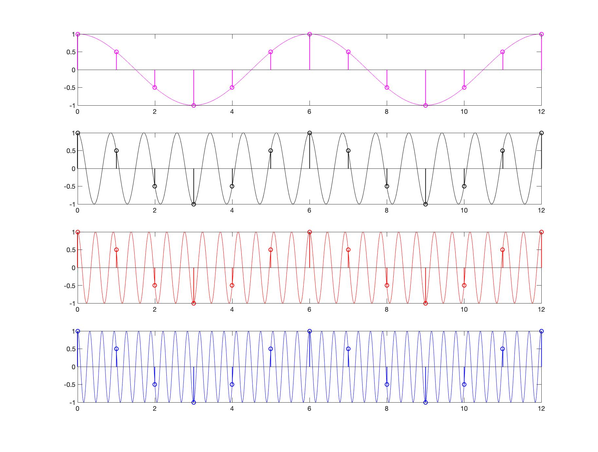

# Ve451
Digital signal processing

#### [discrete_frequemcy.m](https://github.com/YunyyYY/Ve451/blob/master/discrete_frequency.m)
- The highest rate of oscillation in a discrete-time sinusoid is attained when $\omega = \pm \pi$ or $f = \pm 1/2$ .

- Discrete-time sinusoids whose frequencies are separated by an integer multiple of 2\*pi are identical.

